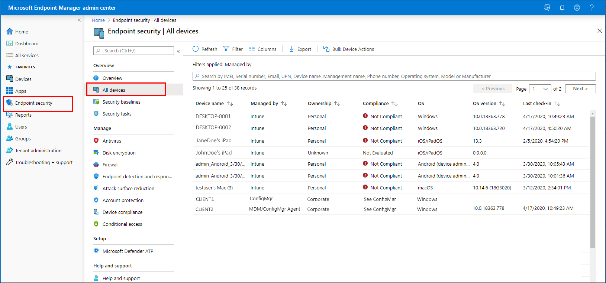
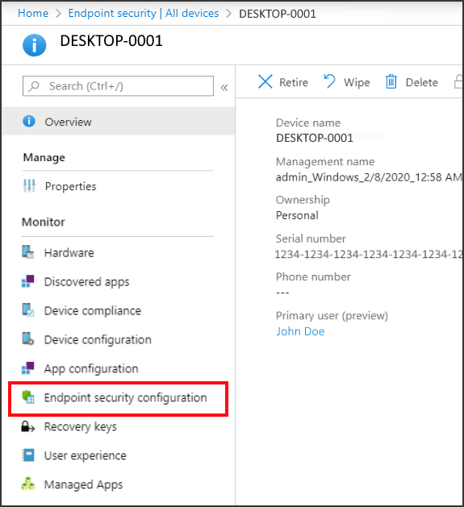

---
# required metadata

title: Manage devices with endpoint security in Microsoft Intune | Microsoft Docs
description: Learn how Security Administrators can use the Endpoint Security node to view devices and act to manage them in Microsoft Endpoint Manager. 
keywords:
author: brenduns
ms.author: brenduns
manager: dougeby
ms.date: 05/15/2020
ms.topic: reference
ms.service: microsoft-intune
ms.subservice: protect
ms.localizationpriority: medium
ms.technology:

# optional metadata

#ROBOTS:
#audience:
#ms.devlang:
ms.suite: ems
search.appverid: MET150
#ms.tgt_pltfrm:
ms.custom: intune-azure
ms.collection: M365-identity-device-management
ms.reviewer: mattsha

---

# Manage devices with endpoint security in Microsoft Intune

As a security administrator, use the *All devices* view in the Microsoft Endpoint Manager admin center to review and act to manage your devices. The view displays a list of all your devices from your Azure Active Directory (Azure AD). This includes devices that are managed by Intune, Configuration Manager, and through [co-management](https://docs.microsoft.com/configmgr/comanage/overview) by both Intune and Configuration Manager. Devices can be in the cloud and from your on-premises infrastructure when integrated with your Azure AD.

 To find the view, open the [Microsoft Endpoint Manager admin center](https://go.microsoft.com/fwlink/?linkid=2109431) and select **Endpoint security** > **All devices**.

The initial *All devices* view displays your devices and includes key information about each:

- How the device is managed
- Compliance status
- Operating system details
- When the device last checked in
- And more

While viewing device details, you can select a device to drill-in for more information.

## Available details by management type

When viewing devices in the Microsoft Endpoint Manager admin center, consider how the device is managed. The management source affects the information that’s presented in the admin center and which actions are available to manage the device.

Consider the following fields:

- **Managed by** – This column identifies how the device is managed. Managed by options include:

  - **MDM**  - These devices are managed by Intune. Compliance data is collected and reported by Intune to the admin center.

  - **ConfigMgr** – These devices appear in the Microsoft Endpoint Manager admin center when you use *tenant attach* to add the devices you manage with Configuration Manager. To be managed, the device must run the Configuration Manager client and be:

    - In a Workgroup (AAD joined and otherwise)
    - Domain Joined
    - Hybrid AAD Joined (joined to the AD and AAD)

    The compliance status for devices that are managed by Configuration Manager isn't visible in the Microsoft Endpoint Manager admin center.

    For more information, see [Enable tenant attach](https://docs.microsoft.com/configmgr/tenant-attach/device-sync-actions) in the Configuration Manager documentation.

  - **MDM/ConfigMgr Agent** – These devices are under co-management between Intune and Configuration Manager.

    With co-management, you [choose different co-management workloads](https://docs.microsoft.com/configmgr/comanage/how-to-switch-workloads) to determine which aspects are managed by Configuration Manager or by Intune. These choices will affect which policies the device applies, and how compliance data is reported to the admin center.

    For example, you can use Intune to configure policy for Antivirus, Firewall, and Encryption. These policy types are considered policy for *Endpoint Protection*. To have a co-managed device use the Intune policies and not the Configuration Manager policies, set the co-management slider for Endpoint Protection to either *Intune* or *Pilot Intune*. If the slider is set to Configuration Manager, the device uses the policies and settings from Configuration Manager instead.

- **Compliance**: Compliance is evaluated against the compliance policies that are assigned to the device. The source of these policies and what information is in the console depends on how the device is managed; Intune, Configuration Manager, or co-management. For co-managed devices to report compliance, set the co-management slider for Device Compliance to either Intune or Pilot Intune.  

  After compliance is reported to the admin center for a device, you can drill into the details to view additional details. When a device isn’t compliant, drill into its details to information about which policies aren't compliant. That information can help you investigate and help you bring the device into compliance.

- **Last check-in**: This field identifies the last time the device  reported its status.

## Review a devices policy

While viewing the list of devices, you can select a device to drill-in for more information about it by opening that device’s *Overview* page.

From the Overview page of a device, you can then select **Endpoint security configuration** to view the endpoint security policies that apply to that device. Policy details are available for devices managed by MDM and Intune.

Devices that are managed by Configuration Manager don’t display policy details. To view additional information for these devices, use the Configuration Manager console.

## Remote actions for devices

Remote actions are actions you can start or apply to a device from the Microsoft Endpoint Manager admin center. When you view details for a device, you can access remote actions that apply to the device.

Remote actions display across the top of the devices *Overview* page. Actions that can’t display because of limited space on your screen are available by selecting the ellipsis on the right side:

The remote actions that are available depend on how the device is managed:

- **Intune**: All [Intune remote actions](../remote-actions/device-management.md) that apply to the device platform are available.  
- **Configuration Manager**: You can use the following Configuration Manager actions:

  - Sync Machine Policy
  - Sync User Policy
  - App Evaluation Cycle

- **Co-management**: You can access both Intune remote actions and Configuration Manager actions.

Some of the Intune remote actions can help secure devices or safeguard data that might be on the device. With remote actions you can:

- Lock a device
- Reset a device
- Remove company data
- Scan for malware outside of a scheduled run
- Rotate BitLocker keys

The following Intune remote actions are of interest to the security admin, and are a subset of the [full list](../remote-actions/device-inventory.md#view-the-device-details). Not all actions are available for all device platforms. The links go to content that provides in-depth details for each action.

- [Synchronize device](../remote-actions/device-sync.md) – Have the device immediately check in with Intune. When a device checks in, it receives any pending actions or policies that have been assigned to it.  

- [Restart](../remote-actions/device-restart.md) – Force a Windows 10 device to restart, within five minutes. The device owner won't automatically be notified of the restart and might lose work.

- [Quick Scan](../configuration/device-restrictions-windows-10.md) – Have Defender run a quick scan of the device for malware and then submit the results to Intune. A quick scan looks at common locations where there could be malware registered, such as registry keys and known Windows startup folders.

- [Full scan](../configuration/device-restrictions-windows-10.md) – Have Defender run a scan of the device for malware and then submit the results to Intune. A full scan looks at common locations where there could be malware registered, and also scans every file and folder on the device.

- Update Windows Defender security intelligence – Have the device update its malware definitions for Microsoft Defender Antivirus. This action doesn’t start a scan.

- [BitLocker key rotation](../protect/encrypt-devices.md#to-rotate-the-bitlocker-recovery-key) – Remotely rotate the BitLocker recovery key of a device that runs Windows 10 version 1909 or later.

You can also use **Bulk Device Actions** to manage some actions like *Retire* and *Wipe* for multiple devices at the same time. [Bulk actions](../remote-actions/bulk-device-actions.md) are available from the *All devices* view. You’ll select the platform, action, and then specify up to 100 devices.

Options you manage for devices don’t take effect until the device checks in with Intune.

## Next steps

[Manage endpoint security in Intune](../protect/endpoint-security.md)